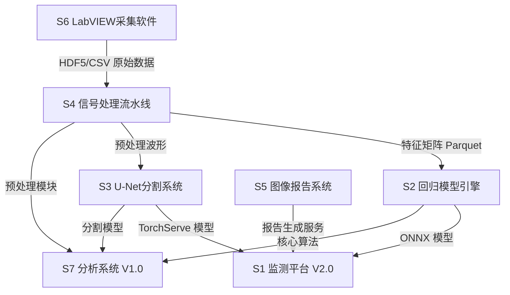

# 聚乙烯补口粘接检测全套软件系统开发计划

---

## 一、软件系统总览

根据报告全文梳理，共识别出以下 **7 大独立软件系统**：


| 编号  | 软件名称                 | 类型          | 核心定位              |
| --- | -------------------- | ----------- | ----------------- |
| S1  | 腐蚀与应力在线监测平台 V2.0     | B/S Web 平台  | 主交付平台，集成全部功能      |
| S2  | 声力耦合回归模型训练与推理引擎      | ML Pipeline | 6 种回归模型训练、优选、部署   |
| S3  | U-Net 超声 C 扫缺陷语义分割系统 | DL Pipeline | 像素级缺陷识别 IoU>=0.92 |
| S4  | 数据预处理与信号处理流水线        | 信号处理库       | 滤波、去噪、特征提取、空间对齐   |
| S5  | 基于大模型的超声图像检测与报告生成系统  | AI+NLG      | C 扫图像分析 + 自动化报告   |
| S6  | LabVIEW 上位机采集控制软件    | 工控软件        | FPGA 同步采集、实时监控    |
| S7  | 聚乙烯粘接声力耦合分析系统 V1.0   | 桌面/命令行      | 独立分析工具（软著登记）      |


---

## 二、S1 — 腐蚀与应力在线监测平台 V2.0

### 2.1 定位与合同指标

- 主交付软件，B/S 架构，单声图端到端分析 **<=0.65s**（合同 <10s）
- 粘接力预测 MAPE **<=1.30%**（合同 <10%）
- 支持千级并发、云/本地混合部署

### 2.2 技术架构

```
接入层: Nginx 1.25 (SSL终结, 负载均衡, 静态资源)
    │
前端层: React 18.2 + TypeScript 5.3 + Ant Design 5.12 + ECharts 5.5
    │                          (Vite 5.1 构建, React Router 6.21)
    │
后端层: FastAPI 0.109 (Python 3.11)
    │   ├── RESTful API (OpenAPI 3.0)
    │   ├── WebSocket (实时推理状态推送)
    │   └── 异步任务队列 (Redis Pub/Sub)
    │
推理层: ONNX Runtime 1.17 (RF/XGBoost/LightGBM/SVR/LR)
    │   TorchServe 0.9 (U-Net, 1D-CNN)
    │
数据层: PostgreSQL 15 (主库) + Redis 7.2 (缓存/队列)
    │   HDF5 (波形原始数据) + 文件系统 (模型/报告)
    │
运维层: Docker 24 + Docker Compose 2.24
        MLflow 2.10 (模型版本) + 审计日志系统
```

### 2.3 八大核心模块 — 文件级分解

**模块 1: 采集数据可视化**

- 文件: `frontend/src/modules/data-visualization/`
  - `WaveformViewer.tsx` — A-scan 时域波形展示（Canvas/WebGL 渲染，支持 10k+ 采样点流畅缩放）
  - `SpectrumViewer.tsx` — FFT 频谱展示（对数/线性坐标切换）
  - `ForceViewer.tsx` — 剥离力曲线展示（双轴联动）
  - `DataImporter.tsx` — CSV/HDF5/MAT 文件导入器（Web Worker 解析，避免阻塞 UI）
  - `QualityScoring.tsx` — 数据质量评分面板（SNR、基线漂移、重复性等指标）
- 后端: `backend/api/routes/data_visualization.py`, `backend/services/data_loader.py`

**模块 2: 声-力数据卡片**

- 文件: `frontend/src/modules/data-cards/`
  - `SinglePointCard.tsx` — 单点数据卡片（波形缩略图、包络、坐标、缺陷标签、预测值）
  - `BatchCardView.tsx` — 批量卡片网格/列表视图
  - `CardFilter.tsx` — 多维度筛选器（缺陷类型、试样编号、预测误差范围）
  - `CardSorter.tsx` — 排序逻辑（按误差、力值、位置等）
- 后端: `backend/api/routes/data_cards.py`

**模块 3: 预处理后波形与频谱预览**

- 文件: `frontend/src/modules/preprocessing-preview/`
  - `ComparisonView.tsx` — 原始 vs 处理后波形/频谱对比（双面板同步缩放）
  - `ParameterPanel.tsx` — 预处理参数实时调节面板
  - `FeatureBarChart.tsx` — 特征提取结果条形图
- 后端: `backend/api/routes/preprocessing.py`, `backend/services/signal_processor.py`

**模块 4: 模型训练与效果对比**

- 文件: `frontend/src/modules/model-training/`
  - `TrainingDashboard.tsx` — 训练控制台（启动/停止/监控）
  - `MetricsChart.tsx` — MAE/RMSE/R²/MAPE 柱状图
  - `RadarComparison.tsx` — 六模型综合性能雷达图
  - `HeatmapView.tsx` — 数值热力图
  - `VersionHistory.tsx` — MLflow 版本管理集成
- 后端: `backend/api/routes/training.py`, `backend/services/model_trainer.py`

**模块 5: 推理监控**

- 文件: `frontend/src/modules/inference-monitor/`
  - `InferenceStatus.tsx` — 推理引擎状态面板（ONNX/TorchServe）
  - `LatencyChart.tsx` — 延迟/吞吐量实时图表
  - `ResourceMonitor.tsx` — GPU 显存、CPU、内存占用
  - `TaskQueue.tsx` — 推理任务队列管理
  - `AlertPanel.tsx` — 超阈值告警
- 后端: `backend/api/routes/inference.py`, `backend/services/inference_engine.py`

**模块 6: 声信号-剥离力耦合视图**

- 文件: `frontend/src/modules/coupling-view/`
  - `DualAxisOverlay.tsx` — 超声特征+剥离力双轴叠加图
  - `CorrelationAnalysis.tsx` — 分段相关性分析（Pearson/Spearman/互信息）
  - `SpatialAlignment.tsx` — 空间坐标对齐可视化
- 后端: `backend/api/routes/coupling.py`, `backend/services/correlation_calculator.py`

**模块 7: 缺陷分析与报告生成**

- 文件: `frontend/src/modules/defect-analysis/`
  - `CScanUploader.tsx` — C 扫图像上传与预览
  - `DefectOverlay.tsx` — 缺陷分割结果叠加展示（热力图/轮廓/标注）
  - `DefectTable.tsx` — 缺陷列表（面积、质心、类型、等级、置信度）
  - `ReportPreview.tsx` — 报告预览与导出（Word）
- 后端: `backend/api/routes/defect_analysis.py`, `backend/services/report_generator.py`

**模块 8: 权限管理与操作审计**

- 文件: `frontend/src/modules/admin/`
  - `RoleManager.tsx` — RBAC 角色管理（管理员/训练工程师/推理工程师/审计员）
  - `AuditLog.tsx` — 审计日志查询与导出
  - `LoginPage.tsx` — JWT 认证登录
- 后端: `backend/api/routes/auth.py`, `backend/services/audit_service.py`, `backend/middleware/auth.py`

### 2.4 文件结构总览

```
platform/
├── frontend/                    # React 前端
│   ├── src/
│   │   ├── modules/             # 8 大功能模块（如上）
│   │   ├── components/          # 通用组件库
│   │   │   ├── charts/          # ECharts 封装
│   │   │   ├── layout/          # 布局组件
│   │   │   └── common/          # 按钮、表单、表格等
│   │   ├── hooks/               # 自定义 Hooks
│   │   ├── services/            # API 调用层 (Axios)
│   │   ├── stores/              # 状态管理
│   │   ├── types/               # TypeScript 类型定义
│   │   └── utils/               # 工具函数
│   ├── public/
│   ├── vite.config.ts
│   ├── tsconfig.json
│   └── package.json
│
├── backend/                     # FastAPI 后端
│   ├── api/
│   │   ├── routes/              # 路由（每模块一个文件）
│   │   └── schemas/             # Pydantic 数据模型
│   ├── services/                # 业务逻辑层
│   ├── models/                  # SQLAlchemy ORM 模型
│   ├── middleware/              # 中间件（认证、日志、CORS）
│   ├── core/                    # 配置、安全、数据库连接
│   ├── tasks/                   # 异步任务
│   ├── tests/                   # 测试
│   │   ├── unit/
│   │   ├── integration/
│   │   └── e2e/
│   ├── main.py
│   └── requirements.txt
│
├── model-serving/               # 模型服务
│   ├── onnx_models/             # ONNX 模型文件
│   ├── torchserve/              # TorchServe 配置
│   │   ├── model-store/
│   │   └── config.properties
│   └── scripts/                 # 模型部署脚本
│
├── docker/
│   ├── Dockerfile.frontend
│   ├── Dockerfile.backend
│   ├── Dockerfile.torchserve
│   └── nginx/
│       └── nginx.conf
│
├── docker-compose.yml
├── .env.example
├── config.yaml
└── README.md
```

### 2.5 质量保障标准

- **代码规范**: ESLint + Prettier (前端), Black + Ruff + mypy (后端)
- **测试覆盖**: 单元测试覆盖率 >=85%, 集成测试覆盖 8 模块全部 API
- **性能基准**: 单声图分析 <=0.65s (P95), 页面首屏 <=2s, API 响应 <=200ms (P99)
- **安全**: TLS 1.3, JWT (2h 有效期), bcrypt 密码哈希, RBAC, 审计日志 append-only
- **兼容性**: Chrome 120+, Firefox 115+, Edge 120+; 1920x1080 / 2560x1440 / 3840x2160
- **稳定性**: 72 小时连续运行无内存泄漏，错误率 0%

---

## 三、S2 — 声力耦合回归模型训练与推理引擎

### 3.1 定位

独立的 ML Pipeline，负责 6 种回归模型的训练、超参优化、评估、导出和部署。

### 3.2 文件结构

```
ml-engine/
├── data/
│   ├── raw/                     # 原始数据 (CSV/HDF5)
│   ├── processed/               # 预处理后数据
│   ├── splits/                  # 训练/验证/测试集划分
│   └── external/                # 外部验证集
│
├── configs/
│   ├── data_config.yaml         # 数据路径、划分比例、特征列
│   ├── model_configs/
│   │   ├── linear_regression.yaml
│   │   ├── svr.yaml
│   │   ├── random_forest.yaml
│   │   ├── xgboost.yaml
│   │   ├── lightgbm.yaml
│   │   └── cnn_1d.yaml
│   └── optuna_config.yaml       # Optuna 搜索空间与策略
│
├── src/
│   ├── data/
│   │   ├── dataset.py           # 数据加载与 Dataset 类
│   │   ├── splitter.py          # 分层抽样划分 (70/15/15)
│   │   └── validator.py         # 数据质量校验
│   │
│   ├── features/
│   │   ├── extractor.py         # 特征提取 (时域/频域/时频/区域统计)
│   │   ├── selector.py          # 特征选择 (互信息/SHAP)
│   │   └── scaler.py            # 标准化/归一化
│   │
│   ├── models/
│   │   ├── base_model.py        # 抽象基类 (统一 train/predict/evaluate/export 接口)
│   │   ├── linear_regression.py
│   │   ├── svr_model.py
│   │   ├── random_forest.py
│   │   ├── xgboost_model.py
│   │   ├── lightgbm_model.py
│   │   └── cnn_1d.py            # PyTorch 1D-CNN
│   │
│   ├── training/
│   │   ├── trainer.py           # 统一训练器 (支持全部 6 种模型)
│   │   ├── optimizer.py         # Optuna 超参优化 (TPE, 100 trials, 5-fold CV)
│   │   ├── evaluator.py         # 评估器 (MAE/RMSE/R²/MAPE + 置信区间)
│   │   └── comparator.py        # 多模型对比与自动排序
│   │
│   ├── inference/
│   │   ├── onnx_exporter.py     # Scikit-learn -> ONNX (skl2onnx)
│   │   ├── torchscript_exporter.py  # PyTorch -> TorchScript
│   │   ├── predictor.py         # 统一推理接口
│   │   └── uncertainty.py       # 蒙特卡洛 Dropout 不确定性估计
│   │
│   ├── experiment/
│   │   ├── mlflow_tracker.py    # MLflow 实验追踪
│   │   ├── model_registry.py    # 模型注册与版本管理
│   │   └── ab_test.py           # A/B 测试支持
│   │
│   └── utils/
│       ├── logger.py            # 结构化日志
│       ├── metrics.py           # 指标计算
│       └── reproducibility.py   # 随机种子与可复现性保障
│
├── scripts/
│   ├── train_all.py             # 一键训练全部模型
│   ├── optimize.py              # 超参搜索入口
│   ├── evaluate.py              # 评估入口
│   ├── export_onnx.py           # 模型导出
│   └── deploy.py                # 模型部署到 TorchServe/ONNX Runtime
│
├── tests/
│   ├── test_data.py
│   ├── test_features.py
│   ├── test_models.py
│   ├── test_training.py
│   ├── test_inference.py
│   └── test_reproducibility.py
│
├── notebooks/
│   ├── 01_eda.ipynb             # 探索性数据分析
│   ├── 02_feature_engineering.ipynb
│   ├── 03_model_comparison.ipynb
│   └── 04_error_analysis.ipynb
│
├── requirements.txt
├── pyproject.toml
└── README.md
```

### 3.3 合同指标验证


| 指标   | 合同要求 | 目标       | 验证方法                  |
| ---- | ---- | -------- | --------------------- |
| MAPE | <10% | <=1.30%  | 测试集 + 5 折交叉验证 + 外部验证集 |
| R²   | -    | >=0.9956 | 同上                    |
| 训练时间 | -    | <1s (RF) | 1000 次重复测试取统计值        |


---

## 四、S3 — U-Net 超声 C 扫缺陷语义分割系统

### 4.1 定位

基于 U-Net + ResNet34 编码器的像素级缺陷分割系统，IoU>=0.92, Dice>=0.96。

### 4.2 文件结构

```
unet-segmentation/
├── data/
│   ├── raw_images/              # 原始 C 扫图像
│   ├── masks/                   # 标注掩码
│   ├── augmented/               # 增强后数据
│   └── splits/                  # 训练/验证/测试划分
│
├── configs/
│   ├── train_config.yaml        # 训练超参 (lr, epochs, batch_size, optimizer)
│   ├── augmentation_config.yaml # Albumentations 增强策略
│   └── inference_config.yaml    # 推理配置
│
├── src/
│   ├── data/
│   │   ├── dataset.py           # PyTorch Dataset (384x768 输入)
│   │   ├── augmentation.py      # Albumentations 管线 (翻转/缩放/旋转/亮度/噪声/弹性变换)
│   │   └── splitter.py          # 数据划分
│   │
│   ├── models/
│   │   ├── unet.py              # U-Net 架构 (smp.Unet, encoder=resnet34, ImageNet 预训练)
│   │   ├── loss.py              # BCE + Dice Loss (可配置权重)
│   │   └── metrics.py           # IoU, Dice, Precision, Recall, F1
│   │
│   ├── training/
│   │   ├── trainer.py           # 训练循环 (AdamW, OneCycleLR, 早停)
│   │   ├── validator.py         # 验证逻辑
│   │   └── callbacks.py         # 检查点、TensorBoard、学习率记录
│   │
│   ├── inference/
│   │   ├── predictor.py         # 单图/批量推理
│   │   ├── postprocessor.py     # 后处理 (阈值化/连通域分析/碎片过滤)
│   │   ├── overlay.py           # 分割结果叠加可视化
│   │   └── torchserve_handler.py # TorchServe 自定义 Handler
│   │
│   └── utils/
│       ├── visualization.py     # 训练过程可视化
│       └── export.py            # ONNX/TorchScript 导出
│
├── scripts/
│   ├── train.py
│   ├── evaluate.py
│   ├── predict.py
│   ├── export_model.py
│   └── benchmark.py             # 推理性能基准测试
│
├── tests/
│   ├── test_dataset.py
│   ├── test_model.py
│   ├── test_training.py
│   ├── test_inference.py
│   └── test_postprocessing.py
│
├── requirements.txt
└── README.md
```

---

## 五、S4 — 数据预处理与信号处理流水线

### 5.1 定位

独立的 Python 信号处理库，处理超声原始波形，提取特征，完成空间对齐。目标处理速度 >=500 点/秒。

### 5.2 文件结构

```
signal-pipeline/
├── src/
│   ├── pipeline/
│   │   ├── pipeline.py          # 主流水线编排器（可配置步骤链）
│   │   ├── step.py              # 抽象处理步骤基类
│   │   └── config.py            # 流水线配置加载
│   │
│   ├── preprocessing/
│   │   ├── dc_removal.py        # 直流分量去除
│   │   ├── frame_alignment.py   # 帧对齐
│   │   ├── bandpass_filter.py   # Butterworth 4 阶带通 (2-8 MHz)
│   │   ├── wavelet_denoising.py # Daubechies-8 小波阈值去噪 (5 级分解, Minimax)
│   │   ├── median_filter.py     # 中值滤波
│   │   ├── baseline_correction.py # 多项式基线校正
│   │   └── normalization.py     # 归一化
│   │
│   ├── feature_extraction/
│   │   ├── time_domain.py       # Vpp, TOF, 包络能量, FWHM, 零交叉率, 波形因子
│   │   ├── frequency_domain.py  # 中心频率, 带宽, 谱熵, 谱矩 (FFT)
│   │   ├── time_frequency.py    # STFT (Hanning窗) + CWT (Morlet小波)
│   │   ├── envelope.py          # Hilbert 变换包络检波 + 移动平均平滑
│   │   └── regional_stats.py    # 区域统计（平均能量、方差、直方图）
│   │
│   ├── spatial/
│   │   ├── alignment.py         # 超声-剥离数据时空对齐 (FPGA 时间戳 + 插值 + 互相关)
│   │   ├── interpolation.py     # 线性/样条插值
│   │   └── grid_mapping.py      # 管道 12x10 网格 / 板型纵向检测带映射
│   │
│   ├── quality/
│   │   ├── snr_calculator.py    # 信噪比计算
│   │   ├── repeatability.py     # 重复性检验
│   │   ├── outlier_detector.py  # 异常值检测与处理
│   │   ├── hash_verifier.py     # 原始数据完整性 Hash 校验
│   │   └── quality_report.py    # 数据质量评估报告生成
│   │
│   └── io/
│       ├── hdf5_reader.py       # HDF5 读取
│       ├── csv_reader.py        # CSV 读取
│       ├── parquet_writer.py    # Parquet 写出 (高效批量训练加载)
│       └── metadata.py          # 元数据管理
│
├── tests/
│   ├── test_preprocessing.py
│   ├── test_feature_extraction.py
│   ├── test_spatial.py
│   ├── test_quality.py
│   └── test_pipeline.py
│
├── benchmarks/
│   └── benchmark_throughput.py  # 吞吐量基准测试 (目标 >=500 点/秒)
│
├── requirements.txt
└── README.md
```

---

## 六、S5 — 基于大模型的超声图像检测与报告生成系统

### 6.1 定位

将视觉（U-Net）、声力耦合（RF）和规则三类信息融合，完成端到端 C 扫图像分析并自动生成 Word 检测报告。

### 6.2 文件结构

```
image-report-system/
├── src/
│   ├── image_processing/
│   │   ├── reader.py            # C 扫图像读取 (PNG/JPG/BMP/TIFF)
│   │   ├── standardizer.py      # 分辨率统一、色彩空间转换 (BGR->RGB/HSV)
│   │   ├── cropper.py           # 自适应裁剪 (去除坐标轴/color bar/界面元素)
│   │   └── preprocessor.py      # 统一尺寸张量输出
│   │
│   ├── roi_detection/
│   │   ├── projector.py         # 亮度投影分析
│   │   ├── roi_generator.py     # 矩形 ROI 自动生成
│   │   └── weld_filter.py       # 焊缝结构检测与排除
│   │
│   ├── defect_analysis/
│   │   ├── feature_extractor.py # 多层次特征 (颜色直方图/LBP/Gabor/U-Net中间层)
│   │   ├── connected_component.py # 连通域分析
│   │   ├── geometry.py          # 几何属性 (面积/质心/外接矩形/长宽比/主轴方向)
│   │   ├── classifier.py       # 缺陷类型与等级判定
│   │   └── confidence_filter.py # 置信度过滤与碎片合并
│   │
│   ├── multimodal_fusion/
│   │   ├── visual_branch.py     # U-Net + ResNet34 视觉表征
│   │   ├── acoustic_branch.py   # 声力耦合 RF 定量预测
│   │   ├── rule_engine.py       # 工艺规则校核
│   │   └── fusion.py            # 三路融合决策
│   │
│   ├── report_generation/
│   │   ├── template_engine.py   # 固定结构模板 (python-docx)
│   │   ├── data_binder.py       # 数据绑定 (图表/表格/文字自动填充)
│   │   ├── nlg_polisher.py      # 中文 NLG 模型润色
│   │   ├── validator.py         # 数字校验 + 术语一致性检查
│   │   └── exporter.py          # Word (.docx) 导出
│   │
│   └── utils/
│       ├── terminology.py       # 术语与指标口径统一管理
│       └── logger.py
│
├── templates/
│   └── report_template.docx     # Word 报告模板
│
├── tests/
│   ├── test_image_processing.py
│   ├── test_roi_detection.py
│   ├── test_defect_analysis.py
│   ├── test_fusion.py
│   └── test_report_generation.py
│
├── requirements.txt
└── README.md
```

---

## 七、S6 — LabVIEW 上位机采集控制软件

### 7.1 定位

基于 LabVIEW 的工控采集软件，控制 FPGA 硬件触发，实现超声-位置-力三类数据的毫秒级同步采集。

### 7.2 文件结构

```
labview-acquisition/
├── Main.vi                      # 主程序面板
├── SubVIs/
│   ├── FPGA_Trigger.vi          # FPGA 触发控制 (位移编码器每 1mm 触发)
│   ├── DAQ_Config.vi            # DAQ 卡配置 (NI USB-6363, 16位, 250 kS/s)
│   ├── Ultrasonic_Interface.vi  # 超声主机通信 (PAUT, 2-10 MHz, >=40 MHz 采样)
│   ├── Force_Acquisition.vi     # 拉力传感器采集 (S型, 1000 Hz)
│   ├── Position_Tracking.vi     # 位置编码器读取 (增量式光电编码器)
│   ├── RealTime_Display.vi      # 实时波形/力值/位置显示
│   ├── Parameter_Panel.vi       # 参数设定面板
│   ├── Data_Storage.vi          # 数据存储 (HDF5/CSV, 含时间戳与元数据)
│   ├── Alarm_Handler.vi         # 异常报警处理
│   ├── Sync_Monitor.vi          # 同步状态监控 (同步误差 <=1ms)
│   └── Calibration.vi           # 传感器校准
│
├── FPGA/
│   ├── FPGA_Bitfile.lvbitx      # FPGA 位流文件 (Xilinx Artix-7)
│   └── FPGA_Trigger_Logic.vi    # FPGA 触发逻辑
│
├── Config/
│   ├── default_params.ini       # 默认参数配置
│   └── calibration_data.json    # 校准数据
│
├── Documentation/
│   ├── 操作手册.docx
│   └── 接口说明.docx
│
└── Tests/
    ├── 同步精度测试.vi
    ├── 数据完整性测试.vi
    └── 长时间运行测试.vi
```

### 7.3 关键技术指标


| 指标       | 要求             |
| -------- | -------------- |
| 同步触发精度   | <=1 ms         |
| 空间触发间隔   | 1 mm (位移编码器)   |
| DAQ 采样精度 | 16 位, 250 kS/s |
| 拉力采样率    | 1000 Hz        |
| 超声采样率    | >=40 MHz       |
| 连续采集稳定性  | >=8 小时无故障      |


---

## 八、S7 — 聚乙烯粘接声力耦合分析系统 V1.0

### 8.1 定位

面向软件著作权登记的独立分析工具，封装核心声力耦合分析算法，可独立运行。

### 8.2 文件结构

```
pe-coupling-analyzer/
├── src/
│   ├── main.py                  # 主入口（CLI + GUI 双模式）
│   ├── gui/
│   │   ├── main_window.py       # 主窗口 (PyQt6/PySide6)
│   │   ├── data_panel.py        # 数据导入与预览
│   │   ├── analysis_panel.py    # 分析控制面板
│   │   ├── result_panel.py      # 结果展示
│   │   └── export_dialog.py     # 导出对话框
│   │
│   ├── core/
│   │   ├── data_loader.py       # 数据加载 (CSV/HDF5)
│   │   ├── preprocessor.py      # 信号预处理 (调用 signal-pipeline)
│   │   ├── feature_engine.py    # 特征提取
│   │   ├── model_loader.py      # 模型加载 (ONNX)
│   │   ├── predictor.py         # 粘接力预测
│   │   ├── segmentor.py         # U-Net 缺陷分割
│   │   └── reporter.py          # 报告生成
│   │
│   └── utils/
│       ├── config.py
│       └── logger.py
│
├── resources/
│   ├── models/                  # 预置 ONNX 模型
│   ├── templates/               # 报告模板
│   └── icons/                   # GUI 图标
│
├── tests/
│   ├── test_core.py
│   ├── test_gui.py
│   └── test_integration.py
│
├── setup.py                     # 安装脚本
├── requirements.txt
└── README.md
```

---

## 九、跨系统集成关系




---

## 十、开发规范与质量标准

### 10.1 代码规范

- **Python**: PEP 8, Black 格式化, Ruff lint, mypy 静态类型检查, docstring (Google 风格)
- **TypeScript**: ESLint + Prettier, 严格模式, 类型覆盖 100%
- **LabVIEW**: NI 编码规范, 子 VI 命名统一, 前面板布局标准

### 10.2 版本控制

- Git Flow 分支策略 (main / develop / feature / release / hotfix)
- Conventional Commits 提交规范
- Code Review 必须 >=1 人 Approve
- CI/CD: GitHub Actions (lint -> test -> build -> deploy)

### 10.3 测试策略

- **单元测试**: pytest (Python), Vitest (TypeScript), 覆盖率 >=85%
- **集成测试**: API 端到端测试, Docker Compose 环境
- **性能测试**: 1000 次重复推理取 P50/P95/P99
- **兼容性测试**: 3 浏览器 x 3 分辨率 x 3 OS
- **稳定性测试**: 72 小时连续运行, 内存泄漏检测
- **安全测试**: OWASP Top 10 扫描, 依赖漏洞扫描

### 10.4 文档体系

- 每个软件独立 README.md (安装/配置/运行/API)
- OpenAPI 3.0 自动生成 API 文档 (FastAPI)
- 架构设计文档 (ADR 格式)
- 用户操作手册
- 部署运维手册

### 10.5 部署策略

- Docker 容器化, 一键 `docker compose up`
- 环境变量管理 (.env), 敏感信息不入库
- 蓝绿部署支持
- 健康检查端点 `/api/health`
- 日志集中化 (结构化 JSON 日志)

---

## 十一、开发里程碑建议


| 阶段                | 周期  | 交付物                                    |
| ----------------- | --- | -------------------------------------- |
| M1: 基础设施          | 2 周 | 项目脚手架、CI/CD、Docker 环境、数据库初始化           |
| M2: 信号处理库 (S4)    | 3 周 | 预处理流水线、特征提取、空间对齐、单元测试                  |
| M3: ML 引擎 (S2)    | 3 周 | 6 种模型训练、Optuna 优化、MLflow 集成、ONNX 导出    |
| M4: U-Net 系统 (S3) | 2 周 | 训练 pipeline、TorchServe 部署、IoU>=0.92 验证 |
| M5: 图像报告系统 (S5)   | 3 周 | 图像分析、多模态融合、报告生成                        |
| M6: Web 平台 (S1)   | 5 周 | 8 大模块前后端开发、集成测试                        |
| M7: LabVIEW (S6)  | 3 周 | 采集控制、FPGA 同步、实时显示                      |
| M8: 分析系统 (S7)     | 2 周 | GUI 开发、核心算法集成、软著文档                     |
| M9: 集成验收          | 2 周 | 全系统集成测试、性能验证、文档定稿                      |


